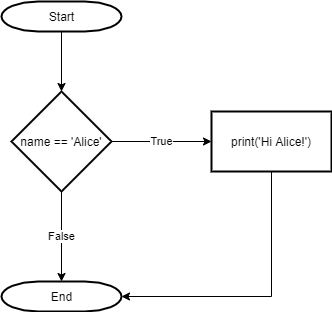
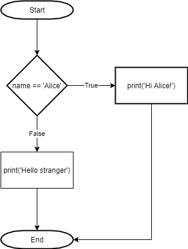
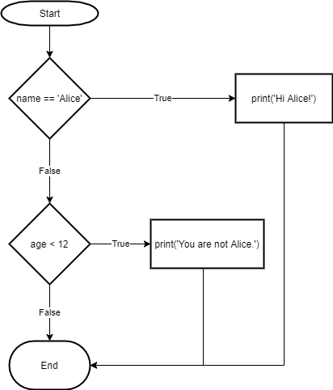
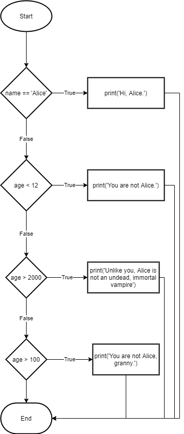
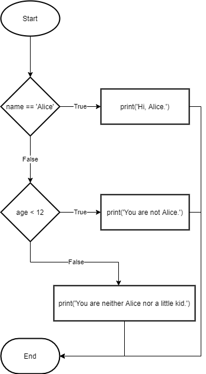
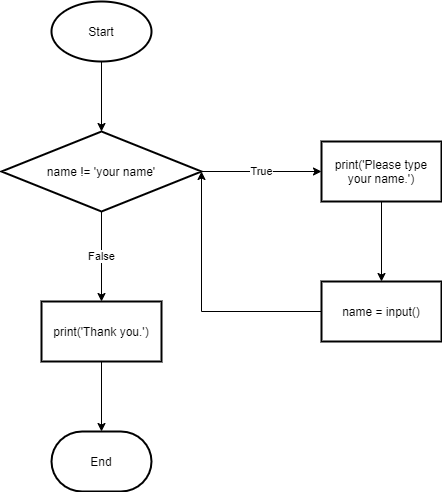
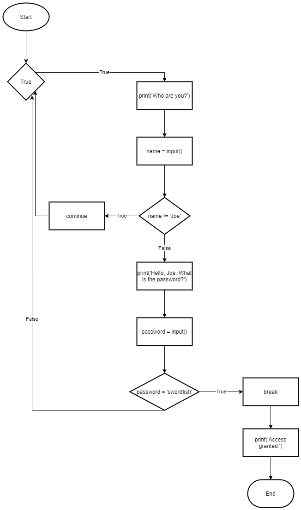

# Chapter 2 - Flow Control - Notes 
## Boolean Values
There are only two Boolean values `True` and `False`.  They do not have '' quotes around them, the first letter `T` and `F` are always capitalized, and the rest of the characters are always lowercase.  
They are used in expressions and can be stored in variables. 

## Comparison Operators
***Comparison operators* or *relational operators* compare two values and evaluate to a single Boolean value**.  That is to say that they evaluate to `True` or `False` . There are six in total: 

|Operator | Meaning|
|:--------|:-------|
|  `==` | equal to |
| `!=` | not equal |
| `>` | greater than |
| `<` | less than |
| `>=` | greater than or equal to |
| `<=` | less than or equal to |

> NOTE: `==` and `!=` can be used on values of any data type. 

## Boolean Operators
There are three Boolean operators used to compare Boolean values. The three operators are `and`, `or`, and `not`. 

### Binary Boolean Operators
The two binanry Boolean Operators are `and` and `or`.  This means that they always take two Boolean values (or expressions). 

The `and` operator evaluates the expression to be `True` if both Boolean values are `True`.  
The `and` Operator's Truth Table
| Expression | Evaluates to... |
|:---------|:----------------|
|`True and True` | `True`   |
|`True and False`| `False`  |
|`False and True`| `False`  |
|`False and False`| `False` |

The `or` operator evaluates to `True` if *either* of the two Boolean values is `True`.  
The `or` Operator's Truth Table
| Expression | Evaluates to... |
|:-----------|:-----------------|
|`True and True` | `True`   |
|`True and False`| `True`  |
|`False and True`| `True`  |
|`False and False`| `False` |

### Unary Operator
The `not` operator only operates on one Boolean value.  It simple evaluates to the oposite Boolean value.  
The `not` Operator's Truth Table
| Expression | Evaluates to... |
|:-----------|:-----------------|
|`not True` | `False`   |
|`not False`| `True`  |

## Mixing Boolean and Comparison Operators
`and`, `or`, and `not` are called *Boolean operators* because they always operate on the Boolean values `True` and `False`.  

Examples:   
>    `>>> 4 > 5 # This expression contains the Boolean operator >, therefore this expression will evaluate to a Boolean value True or False`  
>    `False # The expression is evaluated and is False.`  

    >>> 4 < 5 and 5 < 6      
    True  
    >>> 4 < 5 and 6 > 5    
    False  
    >>> 1 < 2 or 2 > 1    
    True  
    >>> 1 == 2 or 2 == 3    
    False  

The Boolean operators have an order of operations just like the math operators do. After math and comparison operators evaluate, Python evaluates the `not` operators first, then the `and` operators, and then the `or` operators. 

Example:  

    >>> 2 + 2 == 4 and not 2 + 2 == 5 and 2 * 2 == 2 + 2  
    True  

> Math operators, then comparison operators, then boolean operators (`not` > `and` > `or`).    

## Flow Control Elements
Flow control statements start with a part called the *condition* and are always followed by a black of code called the *clause*.  

*Conditions* = expressions, the above examples are *conditions*.  Conditions are expressions just specific to flow control statements. Conditions always evaluate down to a Boolean value (`True` or `False`).   

A flow control statement decides what to do based on whether its condition is `True` or `False`, and almost every flow control statement uses a condition. 

*Blocks* of code - is a group of code.  The beginning of a block is denoted when the indentation is increased. There are three rules for blocks:
 1. Blocks begin when the indentation increases. 
 2. Blocks can contain blocks. 
 3. Blocks end when the indentation decreases to zero or to a containing blocks indentation. 

## Flow Control Statements
### *if* Statements
An `if` statement's clause (the block following the `if` statement) executes if the condition is `True`.  The clause is skipped if the condition is `False`.  An `if` statement consists of the following: 

- The `if` keyword. 
- A condition (an expression that evaluates to a Boolean value, `True` or `False`)
- A colon.
- Starting on the next line, an indented block of code (called the `if` *clause*).  

**All flow control statements end with a colon and are followed by a new block of code (the clause)**  

The following code and flowchart represents an `if` statement. 

    if name == 'Alice':  
       print('Hi Alice')  

    

### *else* Statements
An `if` clause can be followed by and `else` statement.  The `else` clause is only executed if the `if` statements condition is `False`. In English, "If this condition is true, execute this code. Or else, execute that code." An `else` statement doesn't have a condition. In code, and `else` statement always consists of the following: 

- The `else` keyword. 
- A colon. 
- Starting on the next line, an indented block of code (called the `else` clause).  

The following code and flowchart represents an `else` statement.  

    if name == 'Alice':  
        print('Hi Alice')  
    else
        print('Hello stranger.')

    

### *elif* Statements
An `elif` statement is an "else if" statement that always follows an `if` or another `elif` statement. An `elif` provides another condition to be checked only if all privous conditions where `False`. This allows you to text many possible clauses to execute. An `elif` statement always consists of the following:   

- The `elif` keyword. 
- A condition (an expression that evaluates to `True` or `False`). 
- A colon. 
- Starting on the next line, an indented block of code (called the `elif` clause).  

The following code and flowchart represents an `elif` statement.  

    if name == 'Alice':
        print('Hi Allice')
    elif age < 12:
        print('You are not Alice.') 

    

  

Multiple `elif` statements are represented in the following *vampire flowchart*.  Code can be viewed and executed the vampire.py file.  
    name = 'Carol'
    age = 3000
    if name == 'Alice':
        print('Hi, Alice.')
    elif age < 12:
        print('You are not Alice.')
    elif age > 2000:
        print('Unlike you, Alice is not an undead, immortal vampire.')
    elif age > 100:
        print('You are not Alice, granny.')

    

  

"If the first condition is ture, do this. Else, if the second condition is true, do that. Otherwise, do something else."  

The order of `elif` statements does matter.  Once a condition is found to be `True` all of the remaining `elif` statements are skipped. At most only one of the clauses will be executed.  One option is to add an `else` statement after the last `elif` statement. This guarentees that at least one (and only one) of the clauses will be executed. 

The following code and flowchart represent an `if` statement that make use of `elif` clause and an `else` clause.  

    name = 'Carol'
    age = 3000
    if name == 'Alice':
        print('Hi, Alice.')
    elif age < 12:
        print('You are not Alice.')
    else:
        print('You are neither Alice nor a little kid')  

    

   

### *while* Loop Statements
A `while` statement will execute over and over again as long as the statement's condition is `True`.  A `while` statement always consists of the following:  

- The `while` keyword. 
- A condition (an expression that evaluates to `True` or `False`)
- A colon
- Starting on the next line, an indented block of code (called the `while` clause). 

In a `while` loop, the condition is alawys checked at the start of each iteration. If the condition is `True` the clause is executed and then checked again.  If the clause is `False` the `while` clause is skipped.  

The Annoying `while` Loop:
    name = ''
    while name != 'your name':
        print('Please type your name')
        name = input()
    print('Thank you.')  

    

  

### *break* Statements
`break` statements allow you to exit out of a `while` statements clause early. 

The following code and flowchart show an infinite `while` loop with a `break` statement in order to get out of it.  

    while True: 
        print('Please type your name.')
        name = input()
        if name == 'your name':
            break
    print('Thank you!')  

    

  

### *continue* Statements
`continue` statements are used within a loop.  When a program reaches the `continue` statement, it jumps back to the start of the loop and reevaluates the condition. See the following code and flow chart for an example.  

    while True:
        print('Who are you?')
        name = input()
        if name != 'Joe':
            continue
        print('Hello, Joe. What is the password? (It is a fish)')
        password = input()
        if password == 'swordfish':
            break
    print('Access granted.')  

    

  

### *for loops* and the *range()* Function
`for` loops allow you to execute a block of code a certiain number of times with the `range()` function.  This is different from a `while` loop where it keeps loops while its condition is `True`.  

`for` statements look like `for i in range(5):` and include the following:  
- The `for` keyword. 
- A variable name. 
- The `in` keyword. 
- A call to `range()` method with up to three integers passed to it. 
- A colon. 
- Starting on the next line, an indented block of code (called the `for` clause).  

Sample code `for` loop: 
    print('My name is ')
    for i in range(5):
        print('Jimmy Five Times (' + str(i) + ')')

### An Equivalent *while* Loop
    print('My name is')
    i = 0
    while i < 5:
        print('Jimmy Five Times (' + str(i) + ')')
        i = i + 1  

### *Starting*, *Stopping*, and *Stepping* Arguments to *range()*
Up to three integers can be passed to the `range()` function as arguments. 
    for i in range(12, 16):
        print(i)

The first argument `12` is where the first variable where the `for` loop starts.  The second argument `16` will be up to, but not including, the number to stop at. The output of the code above is:  

    12
    13
    14
    15  

The third argument that can be passed to the `range()` function is the *step argument*.  The first argument is the starting point, the second argument is the stopping point, and the third argument is the amount that the variable is increased by after each iteration. 

    for i in range(0, 10, 2):
            print(i)

The output is:  

    0
    2
    4
    6
    8  

